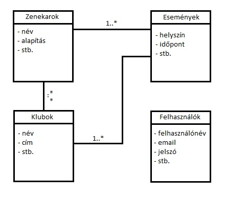

# Dokumentáció
### Fejlesztői környezet bemutatása, beállítása, használt technológiák
A használt fejlesztő környezet a gyakorlatokon is megismert IntelliJ IDEA Community Edition. A szoftver könnyedén letölthető a hivatalos weboldalról, azaz a https://www.jetbrains.com/idea/-ról. Itt az Ultimate edition is választható, melyet 14 napig használhatjuk/kipróbálhatjuk ingyen. Ezek után egy viszonylag gyors egyszerű telepítés és máris fent a gépünkön a program. Egyébként az IntelliJ IDEA első verzióját 2001 januárjában adták ki, és akkoriban egyike volt azoknak az elsőként elérhető Java IDE-knek, melyek továbbfejlesztett kód navigációval és kód refaktorálási képességekkel volt felvértezve. 

A beállításoknál fontos megállapítani, hogy általában nem fogja magától megtalálni a JDK-t (Java Development Kit), így ezt manuálisan kell a File->Project Structure-ben ezt hozzá adni. Ami még szintén fontos, hogy jobb felül a "Select Run/Debug Configuration" (A build és a Run között)-ben pedig a Maven-en belül a Command Line-hoz be kell írnunk, hogy "spring-boot:run".

Használt technológiák?

### Adatbázis-terv: táblák kapcsolati UML diagramja
### Alkalmazott könyvtárstruktúra bemutatása
### Végpont-tervek és leírások
### 1 db végpont működésének leírása, mi történik, milyen lépések követik egymást (szekvenciadiagram)
### fontosabb specifikumok bemutatása (ha van ilyen)

## Beadandó feladat

Készítette:
* Kiss Gergő
* Árvay Balázs

### 1. Projektindító dokumentum

A projekt egy olyan oldalt hivatott előkészíteni és megvalósítani, ami platformot biztosít a zenekarok és a klubok számára, hogy kommunikáljanak, megtalálják egymást és tájékozódni tudjanak a lehetőségeikről. Emellett természetesen segít mindenkinek egy helyre gyűjteni a zenei eseményeket és így egy átlátható listát nyújtani arról, hogy mégis hol milyen koncertek lesznek. Természetesen a klubok és zenekarok mellett így egy új lehetőség a zenét kedvelők számára is, ugyanis böngészhetnek a különböző események között, megnézhetik, hogy kedvenc zenekarok hol lép fel legközelebb, vagy a hozzájuk legközelebb lévő klubban mikor és kik fognak játszani.

#### Funkcionális követelmények:
* Látogató:
	* Klubbok böngészése
	* Zenekarok böngészése
* Regisztrált látogató:
	* Klubok és zenekarok keresése esetleg stílus alapján?
	* Időintervallumra esemény keresés
	* Kedvencek (klub/zenekar)
* Klub-Admin
	* Klub adatlap létrehozása (max. 1 db)
	* Klub adatainak szerkesztése
	* Események létrehozása (pl.: mikor, ki lép fel)
* Zenekar-Admin
	* Zenekar adatlap létrehozása (max. 1 db)
	* Zenekar adatainak szerkesztése
	* Események létrehozása (pl.: hol, mikor lép fel)
* Admin
	* minden adathoz és funkcióhoz hozzáfér
		
#### Nem funkcionális követelmények:
* Felhasználóbarát, ergonomikus elrendezés különböző eszközökön is, kijelzőmérettől függetlenül.
* Gyors és biztonságos működés.
* Jelszavak biztonságos tárolása.
* Felhasználótípusnak megfelelő hozzáférési kör.

#### Szakterületi fogalomjegyzék
* Backline: A színpadon a zenekar mögött helyet foglaló erõsítők (gitárládák), valamint a dob alapjának számító dobtesteket jelenti.
* Backstage: Röviden öltöző. Ez az a szoba vagy terület, ahova csak a zenészek mehetnek be és ahol felkészülnek a koncert előtt, valamint pihennek a zenélés után.
* Biográfia: Egy szöveges leírás, mely a zenekar történetét foglalja magába. Általában egy bő, hosszú leírás, amiben minden fontosabb mérföldkőről, tagcseréről és koncertről szó esik.
* Diszkográfia: A zenekar eddig kiadott hanganyagait tartalmazza. Beletartozik a nagylemez, kislemez és az egymagában kiadott dal, az úgynevezett single is.
* Remaster: egy új "Master", amely többnyire a hangzás följavítására hivatott. Automatikusan megtörténik, ha analógból digitálisra változtatnak. A különbség azonban nem mindig észrevehetõ.
* Sampler: Olyan bejátszások, elektronikus/szimfonikus alapok, melyeket a dalok lejátszásak közben felhasznál a zenekar. Ennek elindítása történhet laptop, telefon és midi-billentyűzet segítségével is.

### 2. Adatbázis

